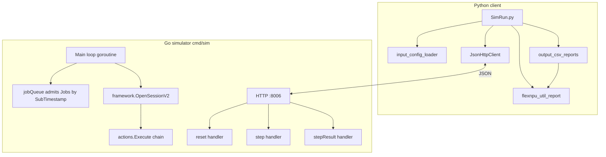
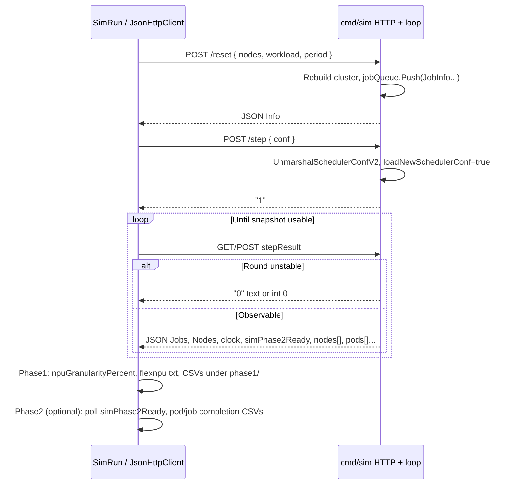

# Volcano Scheduling Simulator — Architecture

This document describes the **logical architecture, module layout, runtime, and data flow** based on the current codebase. It complements [**requirements.md**](./requirements.md) (what the system does vs how it is wired and executed).

---

## 1. Repository layout

```
volcanoSimulator/
├── Volcano_simulator/          # Go: HTTP simulator embedding the Volcano scheduler stack
│   ├── cmd/sim/main.go         # Single entry: HTTP server + main simulation loop
│   └── pkg/
│       ├── simulator/utils.go  # WorkloadType, ConfType, V2Node, Info; YAML → structs
│       └── scheduler/          # Volcano-derived / trimmed scheduler implementation
│           ├── api/            # ClusterInfo, JobInfo, TaskInfo, NodeInfo, Resource…
│           ├── framework/      # Session, Action execution, plugin framework
│           ├── actions/        # Built-in actions: enqueue, allocate, preempt, …
│           ├── plugins/        # gang, drf, predicates, binpack, …
│           ├── cache/          # Scheduler cache (some paths relate to real kube)
│           ├── conf/           # Scheduler config parsing (tiers, plugin args)
│           └── util/           # Node helpers, priority queue, etc.
├── Submit_volcano_workloads/   # Python: config conversion, HTTP client, reports
│   ├── SimRun.py               # Client main flow
│   ├── common/utils/
│   │   └── json_http_client.py # HTTP + JSON (with retries)
│   ├── input_config/
│   │   ├── input_config_loader.py
│   │   ├── flexnpu_util_report.py
│   │   ├── output_csv_reports.py
│   │   ├── phase2_completion_reports.py
│   │   └── __init__.py
│   ├── figures/                # Legacy plotting scripts (off the main path)
│   └── result/                 # Default result root (often .gitignore)
└── docs/
    ├── requirements.md
    ├── architecture.md       # This file
    └── 功能清单与待办.md
```

**Third-party code:** `Volcano_simulator/vendor/` holds Kubernetes, Volcano APIs, etc. Application logic lives under `pkg/` and `cmd/sim`.

---

## 2. Logical layers



| Layer | Role |
| --- | --- |
| **Presentation / I/O** | `main.go` registers routes; `JsonHttpClient` issues requests and `json.loads` responses |
| **Orchestration** | `SimRun`: `reset` → `step` → poll `stepResult`; inject `npuGranularityPercent`; write **phase1/** (and **phase2/** when `runningTime` is used) |
| **Simulation domain** | `ClusterInfo` + per-second loop: admit Jobs, container startup countdown, scheduling Session, advance `NowTime`, optional **`processSimRunningTimeouts`** |
| **Scheduler core** | Volcano `framework` + `actions` + `plugins`, driven by YAML |
| **Observability** | `flexnpu_util_report` estimates FlexNPU from snapshots; `output_csv_reports` writes CSVs |

---

## 3. Go simulator architecture

### 3.1 Process model

- **`main()`** starts **`go server()`** on **`port = ":8006"`** (matches `SimRun.py` default `sim_base_url`).
- The same process runs a **`for true`** main loop **concurrently** with HTTP: advances simulation seconds, admits Jobs, Binding→Running on nodes, **waits for `/step` to deliver config before scheduling**.

### 3.2 Global state (`main.go`)

| Symbol | Role |
| --- | --- |
| `cluster` | `*schedulingapi.ClusterInfo`: Nodes, Jobs, Queues, NamespaceInfo, RevocableNodes |
| `jobQueue` | Priority queue ordered by `SubTimestamp` for `JobInfo` not yet in `cluster.Jobs` |
| `acts` / `tiers` / `cfg` | Parsed by `scheduler.UnmarshalSchedulerConfV2` from the latest `/step` `conf` string |
| `loadNewSchedulerConf` | Whether new config arrived this round; affects whether `stepResult` returns `"0"` |
| `notCompletion` | True while the submit queue is non-empty or any Task is **Binding** |
| `schedulingapi.NowTime` | Simulation clock; incremented by one second at the end of each loop iteration |

### 3.3 HTTP API

| Path | Body | Behavior |
| --- | --- | --- |
| `/reset` | JSON `WorkloadType` (`nodes`, `workload`, `period` strings) | Optionally sets `restartFlag` to drain; rebuilds `cluster`; `Yaml2Nodes` / `Yaml2Jobs`; `NewJobInfoV2` builds Tasks/Pods; Jobs pushed to `jobQueue`; `notCompletion = true`; returns JSON `Info` |
| `/step` | JSON `ConfType{ conf: "<scheduler yaml>" }` | `UnmarshalSchedulerConfV2` → fills `acts/tiers/cfg`; `loadNewSchedulerConf = true`; responds `"1"` |
| `/stepResult` | — | If `loadNewSchedulerConf && notCompletion`, returns **`"0"`**; else `json.Marshal(simulator.Info)` (includes **`simPhase2Ready`** when timed tasks have finished per policy) |
| `/stepResultAnyway` | — | Always returns a slimmer JSON snapshot of `Jobs`/`Nodes`/… |

**Note:** The Python client must treat `stepResult` as either the **`"0"`** placeholder or a **JSON object** (see `SimRun.py`). A bare `0` body parses as JSON **integer** `0`, so `str(resultdata) == '0'` works.

### 3.4 Main loop (conceptual order)

1. Sleep while `restartFlag` or completion gating applies.
2. Pop Jobs from `jobQueue` whose `SubTimestamp` has passed → move into `cluster.Jobs`; **`SetCreationTimestamp(NowTime)`** on each Task’s Pod.
3. Decrement **Binding** tasks’ `CtnCreationCountDown` on each node; per `CtnCreationTimeInterval`, promote one Binding Task to **Running** and set **`Pod.Status.StartTime`** (and **`SimRunningLeft`** when `runningTime` / annotation is set).
4. If a new scheduler config is required: block until **`loadNewSchedulerConf == true`** (set by `/step`).
5. **`ssn := framework.OpenSessionV2(cluster, tiers, cfg)`**; run each **`acts`** entry with **`action.Execute(ssn)`**.
6. **`syncSimulationPodPhases()`** — map Task status to **`Pod.Status.Phase`** (Pending / Running / Succeeded, …).
7. **`processSimRunningTimeouts()`** — decrement per-second countdown for Running tasks with configured duration; on expiry, remove from node, set **Succeeded**, **`SimEndTimestamp`**.
8. **`syncSimulationPodPhases()`** again after completions.
9. Update **`notCompletion`**; add one second to `NowTime`, `cnt++`.

### 3.5 Job / Pod construction (`pkg/scheduler/api/job_info.go`)

- **`NewJobInfoV2(job *batch.Job)`** creates `Replicas` copies from **`Tasks[0]`**, each with a **`v1.Pod`**.
- **Pod.ObjectMeta:** merge **`Task.Template.Annotations`**, then add Volcano group annotations; **Spec** from **`Template.Spec`**.
- Divergence from a real controller: multi-`tasks[]` templates are **not** fully modeled (implementation uses **`Tasks[0]`** only).

### 3.6 Scheduler subsystem (`pkg/scheduler/`)

- **`framework`:** `OpenSessionV2` builds the Session; plugin registration and **`Action`** interface.
- **`actions`:** e.g. enqueue, allocate, backfill, preempt (depends on config).
- **`plugins`:** gang, proportion, drf, predicates, binpack, nodeorder, numaaware, … enabled via **`conf` YAML** tiers.
- **`api/cluster_info.go`:** node **`Idle`/`Used`/`Allocatable`** and Task binding.

---

## 4. Python client architecture

### 4.1 Module dependencies

```
SimRun.py
  ├── common.utils.json_http_client.JsonHttpClient
  ├── input_config.input_config_loader
  │     └── PyYAML: cluster/workload/plugins → strings / paths
  ├── input_config.flexnpu_util_report
  │     └── print_flexnpu_utilization / compute_flexnpu_snapshot
  ├── input_config.output_csv_reports
  │     └── write_output_config_csvs → uses compute_flexnpu_snapshot
  └── input_config.phase2_completion_reports
        └── write_phase2_completion_reports (after simPhase2Ready)
```

### 4.2 `input_config_loader`

- **`cluster_input_to_simulator_yaml`:** YAML → simulator `cluster:` text.
- **`workload_input_to_simulator_yaml`:** normalize `tasks[].template`; **`npuGranularityPercent`** rounds **flexnpu_core** only; writes **`volcano.sh/flexnpu-core.percentage-raw-by-container`** on `template.metadata.annotations`; maps **`runningTime`** to **`volcano.sh/sim-running-time-seconds`**.
- **`load_plugins_for_simulator`:** extract scheduler YAML and **`output.outDir`** (`{date}` expansion).

### 4.3 `flexnpu_util_report`

- **`compute_flexnpu_snapshot(resultdata)`:** card lists and capacity from **Nodes**, **flexnpu-num** from Jobs, **Running/Binding** Pods; **`estimate_card_usage`** produces raw/granular per-card totals and **`pod_chip_share`**.
- Aligns core granularity with **`resultdata["npuGranularityPercent"]`** injected by `SimRun`.

### 4.4 `output_csv_reports`

- **`write_output_config_csvs`:** builds the snapshot and writes **Node_desc / POD_desc / npu_chip / summary**.
- **`sim_clock`:** from **`resultdata["Clock"]` / `clock`** for POD **`submit_time`** fallback.

---

## 5. Runtime sequence (one `SimRun`)



---

## 6. `stepResult` payload (`simulator.Info`)

| JSON field (subset) | Source | Python consumer |
| --- | --- | --- |
| `Jobs` | Serialized `map[JobID]*JobInfo` | `SimRun` task iteration; `flexnpu_util_report`, `output_csv_reports`, `phase2_completion_reports` |
| `Nodes` | `map[string]*NodeInfo` | Node resources, annotations; FlexNPU card lists |
| `nodes` | `[]*v1.Node` summary | Optional |
| `pods` | `[]*v1.Pod` | Redundant with Pods under Jobs; main path uses **Jobs.Tasks[].Pod** |
| `clock` | `NowTime.Local().String()` | CSV `submit_time` fallback, reporting context |
| `simPhase2Ready` | Computed when timed tasks policy is satisfied | `SimRun` phase-2 gate |
| `done` / `NotCompletion` | Completion flags | Depends on struct tags / encoding |

**Note:** Go `encoding/json` uses exported field names; verify against live responses (commonly **`Jobs`**, **`Nodes`**, **`clock`**).

---

## 7. Where to change things

| Goal | Start here |
| --- | --- |
| HTTP port / routes | `Volcano_simulator/cmd/sim/main.go` (`port`, `server()`) |
| Job/Pod metadata | `pkg/scheduler/api/job_info.go` (`NewJobInfoV2`) |
| Simulation time / phases | `main.go` loop, `syncSimulationPodPhases`, Binding→Running, **`processSimRunningTimeouts`** |
| Plugins / action chain | `plugins/*.yaml`, `pkg/scheduler/actions`, `UnmarshalSchedulerConfV2` |
| FlexNPU rounding / annotations | `input_config_loader.py`, `flexnpu_util_report.py` (`estimate_card_usage`) |
| CSV columns | `output_csv_reports.py` |
| Client flow / phases | `SimRun.py`, `phase2_completion_reports.py` |

---

## 8. Related documents

- [**requirements.md**](./requirements.md): scope, I/O contracts, terminology.  
- [**功能清单与待办.md**](./功能清单与待办.md): implemented vs optional checklist.  
- [**README.md**](../README.md): build/run and directory overview.  
- [**Submit_volcano_workloads/input_config/README.md**](../Submit_volcano_workloads/input_config/README.md): input file roles.  
- [**10-Web界面与后端编排架构讨论.md**](./10-Web界面与后端编排架构讨论.md): Web UI, single-user single-run, Python Worker (scheme B), multi-algorithm batch, workload scale, ZIP export.
