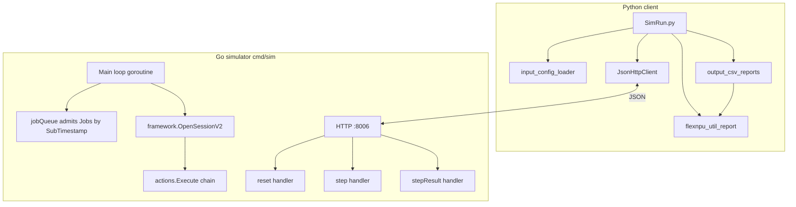
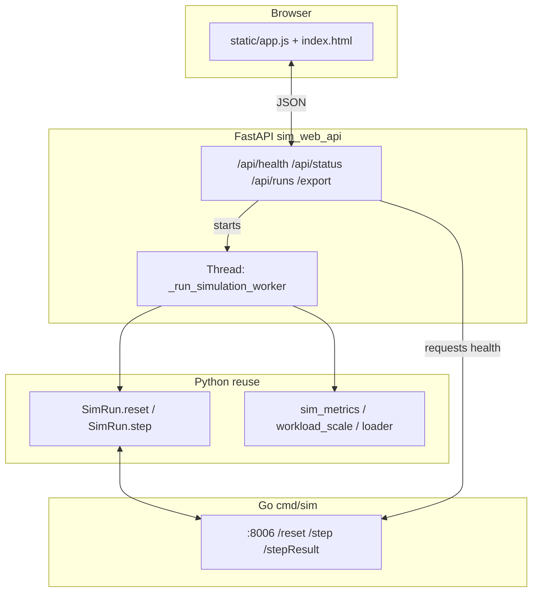

# Volcano Scheduling Simulator — Architecture

This document describes the **logical architecture, module layout, runtime, and data flow** based on the current codebase. It complements [**requirements.md**](./requirements.md) (what the system does vs how it is wired and executed).

---

## 1. Repository layout

```
volcanoSimulator/
├── Volcano_simulator/          # Go: HTTP simulator embedding the Volcano scheduler stack
│   ├── cmd/sim/main.go         # Single entry: HTTP server + main simulation loop
│   └── pkg/
│       ├── simulator/utils.go  # WorkloadType, ConfType, V2Node, Info; YAML → structs
│       └── scheduler/          # Volcano-derived / trimmed scheduler implementation
│           ├── api/            # ClusterInfo, JobInfo, TaskInfo, NodeInfo, Resource…
│           ├── framework/      # Session, Action execution, plugin framework
│           ├── actions/        # Built-in actions: enqueue, allocate, preempt, …
│           ├── plugins/        # gang, drf, predicates, binpack, …
│           ├── cache/          # Scheduler cache (some paths relate to real kube)
│           ├── conf/           # Scheduler config parsing (tiers, plugin args)
│           └── util/           # Node helpers, priority queue, etc.
├── Submit_volcano_workloads/   # Python: config conversion, HTTP client, reports, Web API
│   ├── SimRun.py               # CLI: reset → step → poll stepResult; writes CSVs
│   ├── sim_web_api.py          # FastAPI: uploads, matrix runs, /api/*, serves static/
│   ├── static/                 # Web UI: index.html, app.js, styles.css (mounted /assets)
│   ├── var/sim_web_runs/       # Web run storage (per run_id; .gitignore)
│   ├── requirements.txt        # pip deps: core + FastAPI stack (see file header)
│   ├── common/utils/
│   │   └── json_http_client.py # HTTP + JSON (with retries)
│   ├── input_config/
│   │   ├── input_config_loader.py  # YAML → simulator strings; plugins outDir
│   │   ├── flexnpu_util_report.py
│   │   ├── output_csv_reports.py
│   │   ├── sim_metrics.py      # Chart metrics from stepResult (Web + reuse)
│   │   ├── workload_scale.py   # replicas × factor, ceil (Web matrix)
│   │   └── __init__.py
│   ├── figures/                # Legacy plotting scripts (off the main path)
│   └── result/                 # SimRun default result root (often .gitignore)
└── docs/
    ├── 00-overview.md              # Plain-language introduction
    ├── 02-python-client.md         # Python client deep dive
    ├── 03-go-simulator.md          # Go simulator deep dive
    ├── 04-flexnpu.md               # FlexNPU model
    ├── 05-data-flow-and-http.md    # HTTP protocol reference
    ├── 06-configuration-guide.md   # YAML experiment configs
    ├── 07-code-walkthrough.md      # Key code paths
    ├── architecture.md             # This file
    ├── requirements.md
    └── how-to-develop.md           # Dev / clone workflow notes
```

**Third-party code:** `Volcano_simulator/vendor/` holds Kubernetes, Volcano APIs, etc. Application logic lives under `pkg/` and `cmd/sim`.

---

## 2. Logical layers



| Layer | Role |
| --- | --- |
| **Presentation / I/O** | `main.go` registers routes; `JsonHttpClient` issues requests and `json.loads` responses |
| **Orchestration** | `SimRun`: `reset` → `step` → poll `stepResult`; inject `npuGranularityPercent`; write CSVs / FlexNPU text under `plugins` `outDir`. **`sim_web_api`** runs the same `reset`/`step` in a worker thread for each (plugin × scale) cell. |
| **Simulation domain** | `ClusterInfo` + per-second loop: admit Jobs, container startup countdown, scheduling Session, advance `NowTime`, optional **`processSimRunningTimeouts`** |
| **Scheduler core** | Volcano `framework` + `actions` + `plugins`, driven by YAML |
| **Observability** | `flexnpu_util_report` estimates FlexNPU from snapshots; `output_csv_reports` writes CSVs |

---

## 3. Go simulator architecture

### 3.1 Process model

- **`main()`** starts **`go server()`** on **`port = ":8006"`** (matches `SimRun.py` default `sim_base_url`).
- The same process runs a **`for true`** main loop **concurrently** with HTTP: advances simulation seconds, admits Jobs, Binding→Running on nodes, **waits for `/step` to deliver config before scheduling**.

### 3.2 Global state (`main.go`)

| Symbol | Role |
| --- | --- |
| `cluster` | `*schedulingapi.ClusterInfo`: Nodes, Jobs, Queues, NamespaceInfo, RevocableNodes |
| `jobQueue` | Priority queue ordered by `SubTimestamp` for `JobInfo` not yet in `cluster.Jobs` |
| `acts` / `tiers` / `cfg` | Parsed by `scheduler.UnmarshalSchedulerConfV2` from the latest `/step` `conf` string |
| `loadNewSchedulerConf` | Whether new config arrived this round; affects whether `stepResult` returns `"0"` |
| `notCompletion` | True while the submit queue is non-empty or any Task is **Binding** |
| `schedulingapi.NowTime` | Simulation clock; incremented by one second at the end of each loop iteration |

### 3.3 HTTP API

| Path | Body | Behavior |
| --- | --- | --- |
| `/reset` | JSON `WorkloadType` (`nodes`, `workload`, `period` strings) | Optionally sets `restartFlag` to drain; rebuilds `cluster`; `Yaml2Nodes` / `Yaml2Jobs`; `NewJobInfoV2` builds Tasks/Pods; Jobs pushed to `jobQueue`; `notCompletion = true`; returns JSON `Info` |
| `/step` | JSON `ConfType{ conf: "<scheduler yaml>" }` | `UnmarshalSchedulerConfV2` → fills `acts/tiers/cfg`; `loadNewSchedulerConf = true`; responds `"1"` |
| `/stepResult` | — | If `loadNewSchedulerConf && notCompletion`, returns **`"0"`**; else `json.Marshal(simulator.Info)` (includes **`simPhase2Ready`** when timed tasks have finished per policy) |
| `/stepResultAnyway` | — | Always returns a slimmer JSON snapshot of `Jobs`/`Nodes`/… |

**Note:** The Python client must treat `stepResult` as either the **`"0"`** placeholder or a **JSON object** (see `SimRun.py`). A bare `0` body parses as JSON **integer** `0`, so `str(resultdata) == '0'` works.

### 3.4 Main loop (conceptual order)

1. Sleep while `restartFlag` or completion gating applies.
2. Pop Jobs from `jobQueue` whose `SubTimestamp` has passed → move into `cluster.Jobs`; **`SetCreationTimestamp(NowTime)`** on each Task’s Pod.
3. Decrement **Binding** tasks’ `CtnCreationCountDown` on each node; per `CtnCreationTimeInterval`, promote one Binding Task to **Running** and set **`Pod.Status.StartTime`** (and **`SimRunningLeft`** when `runningTime` / annotation is set).
4. If a new scheduler config is required: block until **`loadNewSchedulerConf == true`** (set by `/step`).
5. **`ssn := framework.OpenSessionV2(cluster, tiers, cfg)`**; run each **`acts`** entry with **`action.Execute(ssn)`**.
6. **`syncSimulationPodPhases()`** — map Task status to **`Pod.Status.Phase`** (Pending / Running / Succeeded, …).
7. **`processSimRunningTimeouts()`** — decrement per-second countdown for Running tasks with configured duration; on expiry, remove from node, set **Succeeded**, **`SimEndTimestamp`**.
8. **`syncSimulationPodPhases()`** again after completions.
9. Update **`notCompletion`**; add one second to `NowTime`, `cnt++`.

### 3.5 Job / Pod construction (`pkg/scheduler/api/job_info.go`)

- **`NewJobInfoV2(job *batch.Job)`** creates `Replicas` copies from **`Tasks[0]`**, each with a **`v1.Pod`**.
- **Pod.ObjectMeta:** merge **`Task.Template.Annotations`**, then add Volcano group annotations; **Spec** from **`Template.Spec`**.
- Divergence from a real controller: multi-`tasks[]` templates are **not** fully modeled (implementation uses **`Tasks[0]`** only).

### 3.6 Scheduler subsystem (`pkg/scheduler/`)

- **`framework`:** `OpenSessionV2` builds the Session; plugin registration and **`Action`** interface.
- **`actions`:** e.g. enqueue, allocate, backfill, preempt (depends on config).
- **`plugins`:** gang, proportion, drf, predicates, binpack, nodeorder, numaaware, … enabled via **`conf` YAML** tiers.
- **`api/cluster_info.go`:** node **`Idle`/`Used`/`Allocatable`** and Task binding.

---

## 4. Python client architecture

### 4.1 Module dependencies

```
SimRun.py
  ├── common.utils.json_http_client.JsonHttpClient
  ├── input_config.input_config_loader
  │     └── PyYAML: cluster/workload/plugins → strings / paths
  ├── input_config.flexnpu_util_report
  │     └── print_flexnpu_utilization / compute_flexnpu_snapshot
  └── input_config.output_csv_reports
        └── write_output_config_csvs → uses compute_flexnpu_snapshot

sim_web_api.py
  ├── SimRun.reset, SimRun.step  (same HTTP flow as CLI; step returns snapshot dict)
  ├── input_config_loader: cluster_yaml_text_to_simulator_yaml,
  │       workload_doc_to_simulator_yaml, workload_npu_granularity_percent_from_doc,
  │       plugins_document_scheduler_and_outdir
  ├── workload_scale.scale_workload_document
  └── sim_metrics.compute_chart_metrics
```

### 4.2 `input_config_loader`

- **`cluster_input_to_simulator_yaml`:** YAML → simulator `cluster:` text.
- **`workload_input_to_simulator_yaml`:** normalize `tasks[].template`; **`npuGranularityPercent`** rounds **flexnpu_core** only; writes **`volcano.sh/flexnpu-core.percentage-raw-by-container`** on `template.metadata.annotations`; maps **`runningTime`** to **`volcano.sh/sim-running-time-seconds`**.
- **`load_plugins_for_simulator`:** extract scheduler YAML and **`output.outDir`** (`{date}` expansion).
- **Web-oriented helpers (same module):** **`cluster_yaml_text_to_simulator_yaml`**, **`workload_yaml_text_to_simulator_yaml`**, **`workload_doc_to_simulator_yaml`**, **`workload_npu_granularity_percent_from_doc`**, **`plugins_document_scheduler_and_outdir(doc, result_out_dir)`** — bypass `{date}` for uploads by forcing an absolute per-cell result directory.

### 4.3 `flexnpu_util_report`

- **`compute_flexnpu_snapshot(resultdata)`:** card lists and capacity from **Nodes**, **flexnpu-num** from Jobs, **Running/Binding** Pods; **`estimate_card_usage`** produces raw/granular per-card totals and **`pod_chip_share`**.
- Aligns core granularity with **`resultdata["npuGranularityPercent"]`** injected by `SimRun`.

### 4.4 `output_csv_reports`

- **`write_output_config_csvs`:** builds the snapshot and writes **Node_desc / POD_desc / npu_chip / summary**.
- **`sim_clock`:** from **`resultdata["Clock"]` / `clock`** for POD **`submit_time`** fallback.

### 4.5 `workload_scale`

- **`scale_workload_document(doc, factor)`:** deep-copies workload YAML; for each job task with **`replicas`**, sets **`replicas = max(1, ceil(replicas * factor))`** (used by the Web matrix).

### 4.6 `sim_metrics`

- **`compute_chart_metrics(resultdata)`:** reads **`Nodes`** / **`Jobs`** from a **`stepResult`**-shaped dict.
  - **`allocation_rate_avg`:** mean of per-node **flexnpu_core** allocation rate (%), consistent with **Node_desc** (scheduler **Used/Allocatable** scalars ÷ 1000).
  - **`running_pods`:** count of Pods with **`status.phase == "Running"`** (first snapshot after `step`).
  - **`fragmentation_rate`:** \((\sum_i \mathrm{remain}_i - \max_i \mathrm{remain}_i) / \sum_i \mathrm{cap}_i \times 100\) where **remain** = allocatable − used core per node (same units as above).
  - Also returns aggregate capacity/remaining fields for debugging or future UI.

---

## 5. Web UI architecture (`sim_web_api.py` + `static/`)

### 5.1 Purpose and constraints

- **Single-user, single concurrent run:** `POST /api/runs` returns **409** if the worker thread from a previous submission is still **`thread.is_alive()`**.
- **Browser never talks to Go directly:** the FastAPI process calls **`VOLCANO_SIM_URL`** (default **`http://127.0.0.1:8006`**) via **`requests`** for health checks and via **`SimRun.reset` / `SimRun.step`** (which use **`JsonHttpClient`**) for simulation.
- **Static assets:** **`GET /`** serves **`static/index.html`**. **`GET /assets/*`** is a **`StaticFiles`** mount of **`static/`** (CSS/JS), registered **after** API routes so **`/api/*`** is never shadowed.

### 5.2 Run matrix

For each uploaded **plugins** file \(i\) (each must contain a **`scheduler`** block) and each numeric **workload scale** \(s\) from comma-separated **`workload_scales`**:

1. **`scale_workload_document(base_workload, s)`** then **`workload_doc_to_simulator_yaml`**.
2. **`plugins_document_scheduler_and_outdir(plug_doc, out_sub)`** with **`out_sub = var/sim_web_runs/<run_id>/results/<algo_id>_scale_<s>/`** (dots in scale normalized for path segments).
3. **`reset(sim_url, nodes_yaml, workload_yaml)`** then **`step(..., pods_url, npu_granularity)`**.
4. **`step`** returns the snapshot dict; **`compute_chart_metrics`** merges into **`RunState.chart.points`**; same directory receives **`write_output_config_csvs`** output as in CLI (**tasksSUM.csv**, **Node_desc.csv**, etc.).

Uploaded text is normalized (**BOM strip**, newline unify, collapse duplicate blank lines) before save under **`input/`**.

### 5.3 Process and state

| Mechanism | Role |
| --- | --- |
| **`threading.Thread`** | Runs **`_run_simulation_worker`** so **`POST /api/runs`** returns immediately with **`run_id`**. |
| **`_active` dict** | **`run_id`**, **`thread`**, **`state`** (`RunState` pydantic instance). |
| **`_lock`** | Held only for starting a run and reading **`run_id`/`state`** references; worker mutates **`state`** in place (acceptable for this single-run UI). |
| **`RunState`** | **`status`**: `running` \| `succeeded` \| `failed`; **`progress_percent`**, **`done_steps`**, **`total_steps`**, **`message`**, **`chart`**, **`error`**, **`run_dir`**. |

Progress updates: small bump at loop start; after **`reset`**, **`~35%` of one matrix cell** before **`step`**; after each cell completes, **`done_steps/total*100`**. **`manifest.json`** and **`chart_data.json`** are written at success under **`run_dir`**.

### 5.4 HTTP API summary

| Method | Path | Description |
| --- | --- | --- |
| **GET** | **`/api/health`** | **`simulator_reachable`**: POST **`/stepResult`** to Go with short timeout; returns **`simulator_url`**, **`simulator_detail`**. |
| **GET** | **`/api/status`** | **`{ "run_id", "state": RunState.model_dump() }`** — frontend reads **`state.progress_percent`**, **`state.chart`**, etc. |
| **POST** | **`/api/runs`** | **multipart**: **`cluster`**, **`workload`**, **`workload_scales`**, one or more **`plugins`** files. Validates YAML; saves under **`var/sim_web_runs/<id>/input/`**; starts worker. |
| **GET** | **`/api/runs/latest/export`** | ZIP of **`results/**`** tree + **`manifest.json`** + **`chart_data.json`**; **409** unless last run **`succeeded`**. |
| **GET** | **`/`** | **`index.html`** |

**CORS:** **`allow_origins=["*"]`** for local/dev; tighten for production.

### 5.5 Web data flow (high level)



### 5.6 Frontend behavior (see `static/app.js`)

- Polls **`/api/health`** every 4s; shows **Simulator: OK** vs **Simulator: not OK (detail)**.
- **Start Simulation** stays **disabled** until **`simulator_reachable`** and is disabled again while a run is in progress (after **`POST` succeeds**).
- Polls **`/api/status`** ~400ms while running; progress bar uses **`state.progress_percent`**.
- File inputs are **hidden**; **Choose file…** / **No file chosen** buttons avoid OS-locale native file widget strings.

---

## 6. Runtime sequence (one `SimRun`)

```mermaid
sequenceDiagram
  participant Py as SimRun / JsonHttpClient
  participant Go as cmd/sim HTTP + loop

  Py->>Go: POST /reset { nodes, workload, period }
  Go->>Go: Rebuild cluster, jobQueue.Push(JobInfo...)
  Go-->>Py: JSON Info

  Py->>Go: POST /step { conf }
  Go->>Go: UnmarshalSchedulerConfV2, loadNewSchedulerConf=true
  Go-->>Py: "1"

  loop Until snapshot usable
    Py->>Go: GET/POST stepResult
    alt Round unstable
      Go-->>Py: "0" text or int 0
    else Observable
      Go-->>Py: JSON Jobs, Nodes, clock, simPhase2Ready, nodes[], pods[]...
    end
  end

  Py->>Py: Inject npuGranularityPercent; flexnpu txt + CSVs under plugins outDir
```

---

## 7. `stepResult` payload (`simulator.Info`)

| JSON field (subset) | Source | Python consumer |
| --- | --- | --- |
| `Jobs` | Serialized `map[JobID]*JobInfo` | `SimRun` task iteration; `flexnpu_util_report`, `output_csv_reports`, `phase2_completion_reports` |
| `Nodes` | `map[string]*NodeInfo` | Node resources, annotations; FlexNPU card lists |
| `nodes` | `[]*v1.Node` summary | Optional |
| `pods` | `[]*v1.Pod` | Redundant with Pods under Jobs; main path uses **Jobs.Tasks[].Pod** |
| `clock` | `NowTime.Local().String()` | CSV `submit_time` fallback, reporting context |
| `simPhase2Ready` | Computed when timed tasks policy is satisfied | Go exposes in JSON; current **`SimRun.py`** / **`sim_web_api`** path uses a single **`step`** snapshot only (no extra phase-2 client loop in repo) |
| `done` / `NotCompletion` | Completion flags | Depends on struct tags / encoding |

**Note:** Go `encoding/json` uses exported field names; verify against live responses (commonly **`Jobs`**, **`Nodes`**, **`clock`**).

---

## 8. Where to change things

| Goal | Start here |
| --- | --- |
| HTTP port / routes | `Volcano_simulator/cmd/sim/main.go` (`port`, `server()`) |
| Job/Pod metadata | `pkg/scheduler/api/job_info.go` (`NewJobInfoV2`) |
| Simulation time / phases | `main.go` loop, `syncSimulationPodPhases`, Binding→Running, **`processSimRunningTimeouts`** |
| Plugins / action chain | `plugins/*.yaml`, `pkg/scheduler/actions`, `UnmarshalSchedulerConfV2` |
| FlexNPU rounding / annotations | `input_config_loader.py`, `flexnpu_util_report.py` (`estimate_card_usage`) |
| CSV columns | `output_csv_reports.py` |
| Client flow | `SimRun.py` |
| Web API / uploads / progress | `sim_web_api.py`, `static/app.js` |
| Web chart metrics | `input_config/sim_metrics.py` |
| Workload scale matrix | `input_config/workload_scale.py` |

---

## 9. Related documents

- [**requirements.md**](./requirements.md): scope, I/O contracts, terminology.  
- [**00-overview.md**](./00-overview.md): plain-language overview and reading order.  
- [**02-python-client.md**](./02-python-client.md) … [**07-code-walkthrough.md**](./07-code-walkthrough.md): tutorial series (Python, Go, FlexNPU, HTTP, configs, code).  
- [**README.md**](../README.md): build/run, Web UI, directory overview.  
- [**Submit_volcano_workloads/requirements.txt**](../Submit_volcano_workloads/requirements.txt): Python packages and rationale.  
- [**Submit_volcano_workloads/input_config/README.md**](../Submit_volcano_workloads/input_config/README.md): input file roles.  
- [**how-to-develop.md**](./how-to-develop.md): clone and dev workflow notes.  
- **Web UI product notes (Chinese draft, if present in repo):** `10-Web界面与后端编排架构讨论.md` — implementation is **`sim_web_api.py`** + **`static/`**; see **§5 Web UI architecture** in this file.
