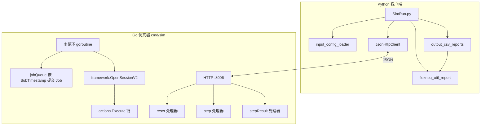
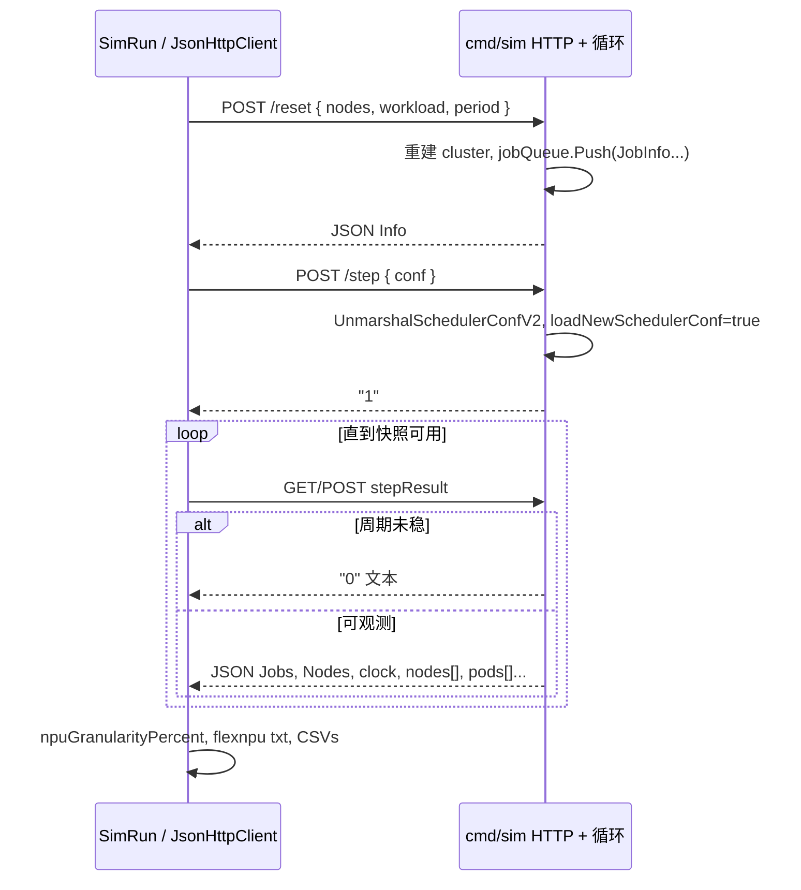

# Volcano 调度仿真系统 — 架构文档

本文档依据当前仓库代码描述**逻辑架构、模块划分、运行时与数据流**；与 [**需求文档.md**](./需求文档.md) 互为补充（需求文档偏「做什么」，本文偏「怎么组织、怎么跑通」）。

---

## 1. 仓库物理结构

```
volcanoSimulator/
├── Volcano_simulator/          # Go：内嵌 Volcano 调度栈的 HTTP 仿真进程
│   ├── cmd/sim/main.go         # 唯一入口：HTTP 服务 + 主仿真循环
│   └── pkg/
│       ├── simulator/utils.go  # WorkloadType、ConfType、V2Node、Info；YAML→结构体
│       └── scheduler/          # 自 Volcano 迁入/裁剪的调度实现
│           ├── api/            # ClusterInfo、JobInfo、TaskInfo、NodeInfo、Resource…
│           ├── framework/      # Session、Action 执行、插件框架
│           ├── actions/        # enqueue、allocate、preempt 等内置动作
│           ├── plugins/        # gang、drf、predicates、binpack…
│           ├── cache/          # 调度缓存（部分路径与真实 kube 交互相关）
│           ├── conf/           # 调度器配置解析（tiers、plugin args）
│           └── util/           # 节点构建、优先级队列等工具
├── Submit_volcano_workloads/   # Python：配置转换、HTTP 客户端、报表
│   ├── SimRun.py               # 客户端主流程
│   ├── common/utils/
│   │   └── json_http_client.py # HTTP + JSON 封装（含重试）
│   ├── input_config/
│   │   ├── input_config_loader.py
│   │   ├── flexnpu_util_report.py
│   │   ├── output_csv_reports.py
│   │   └── __init__.py
│   ├── figures/                # 历史作图脚本（非主链路）
│   └── result/                 # 默认结果输出根（.gitignore 常见）
└── docs/
    ├── 需求文档.md
    └── 架构文档.md             # 本文
```

**第三方依赖**：`Volcano_simulator/vendor/` 含 Kubernetes、Volcano API 等；业务代码以 `pkg/` 与 `cmd/sim` 为准。

---

## 2. 逻辑分层



| 层 | 职责 |
| --- | --- |
| **表现/接入** | `main.go` 注册路由；`JsonHttpClient` 发起请求并 `json.loads` 响应 |
| **应用编排** | `SimRun`：`reset` → `step` → 轮询 `stepResult`；注入 `npuGranularityPercent` 后写文件 |
| **领域仿真** | `ClusterInfo` + 每秒循环：提交 Job、容器创建倒计时、调度 Session、推进 `NowTime` |
| **调度内核** | Volcano `framework` + `actions` + `plugins`，由 YAML 配置驱动 |
| **观测与报表** | `flexnpu_util_report` 从快照估算 FlexNPU；`output_csv_reports` 落 CSV |

---

## 3. Go 仿真器架构

### 3.1 进程模型

- **`main()`** 启动 **`go server()`** 监听 **`port = ":8006"`**（与 `SimRun.py` 默认 `sim_base_url` 一致）。
- 同进程内另有一 **`for true`** 主循环（与 HTTP 并发）：驱动仿真秒针、Job 入集群、节点上 Binding→Running、以及**等待 `/step` 下发配置后再执行调度**。

### 3.2 全局核心状态（`main.go`）

| 符号 | 类型/含义 |
| --- | --- |
| `cluster` | `*schedulingapi.ClusterInfo`：Nodes、Jobs、Queues、NamespaceInfo、RevocableNodes |
| `jobQueue` | 按 `SubTimestamp` 排序的优先级队列，尚未进入 `cluster.Jobs` 的 `JobInfo` |
| `acts` / `tiers` / `cfg` | 由 `scheduler.UnmarshalSchedulerConfV2` 解析自最近一次 `/step` 的 `conf` 字符串 |
| `loadNewSchedulerConf` | 本周期是否已收到新配置；与 `stepResult` 是否返回 `"0"` 相关 |
| `notCompletion` | 仍有待提交 Job 或仍存在 Binding Task 时为 true |
| `schedulingapi.NowTime` | 仿真时钟，主循环末尾每秒 `Add(1e9)` |

### 3.3 HTTP 接口与处理器

| 路径 | 方法/体 | 行为概要 |
| --- | --- | --- |
| `/reset` | JSON：`WorkloadType`（`nodes`、`workload`、`period` 字符串） | 可选先置 `restartFlag` 清空；重建 `cluster`；`Yaml2Nodes` / `Yaml2Jobs`；`NewJobInfoV2` 建 Task/Pod；Job 入 `jobQueue`；`notCompletion = true`；返回 JSON `Info` |
| `/step` | JSON：`ConfType{ conf: "<scheduler yaml>" }` | `UnmarshalSchedulerConfV2` → 填充 `acts/tiers/cfg`；`loadNewSchedulerConf = true`；响应 `"1"` |
| `/stepResult` | - | 若 `loadNewSchedulerConf && notCompletion` 则返回 **`"0"`**（字符串）；否则 `json.Marshal(simulator.Info)` |
| `/stepResultAnyway` | - | 始终返回当前 `Jobs`/`Nodes` 等的 JSON（字段较精简） |

**注意**：Python 侧对 `stepResult` 需兼容响应为 **`"0"`** 与 **JSON 字典** 两种形态（见 `SimRun.py`）。

### 3.4 主循环关键步骤（代码顺序抽象）

1. `restartFlag` / 无作业完成条件时 sleep。
2. 从 `jobQueue` 弹出已到 `SubTimestamp` 的 Job → 写入 `cluster.Jobs`，并为各 Task **`SetCreationTimestamp(NowTime)`**。
3. 递减各节点上 **Binding** Task 的 `CtnCreationCountDown`；按节点 `CtnCreationTimeInterval` 将某 Binding Task 置 **Running**，写 **`Pod.Status.StartTime`**。
4. 若需新配置：阻塞直到 **`loadNewSchedulerConf == true`**（由 `/step` 置位）。
5. **`ssn := framework.OpenSessionV2(cluster, tiers, cfg)`**，遍历 **`acts`** 执行 **`action.Execute(ssn)`**。
6. **`syncSimulationPodPhases()`**：将 Task 状态映射为对外 **`Pod.Status.Phase`**（Pending/Running）。
7. 更新 **`notCompletion`**；`NowTime` 加 1 秒，`cnt++`。

### 3.5 Job / Pod 构造（`pkg/scheduler/api/job_info.go`）

- **`NewJobInfoV2(job *batch.Job)`**：按 `Tasks[0].Replicas` 创建多个 `TaskInfo`，每个挂一个 **`v1.Pod`**。
- **Pod.ObjectMeta**：合并 **`Task.Template.Annotations`**，再写入 Volcano group 注解；**Spec** 来自 **`Template.Spec`**。
- 与真实控制器差异：同一 Job 多 Task 定义、多任务类型等需以当前实现为准（当前循环以 **`Tasks[0]`** 为模板源）。

### 3.6 调度子系统（`pkg/scheduler/`）

- **`framework`**：`OpenSessionV2` 构建 Session；插件注册与 **`Action`** 接口。
- **`actions`**：如 enqueue、allocate、backfill、preempt（具体以配置为准）。
- **`plugins`**：gang、proportion、drf、predicates、binpack、nodeorder、numaaware 等；由 **`conf` YAML** 的 tiers 启用。
- **`api/cluster_info.go`** 等：节点资源 **`Idle`/`Used`/`Allocatable`** 与 Task 绑定关系。

---

## 4. Python 客户端架构

### 4.1 模块依赖关系

```
SimRun.py
  ├── common.utils.json_http_client.JsonHttpClient
  ├── input_config.input_config_loader
  │     └── PyYAML：cluster/workload/plugins → 字符串 / 路径
  ├── input_config.flexnpu_util_report
  │     └── print_flexnpu_utilization / compute_flexnpu_snapshot
  └── input_config.output_csv_reports
        └── write_output_config_csvs → 依赖 flexnpu_util_report.compute_flexnpu_snapshot
```

### 4.2 `input_config_loader`

- **`cluster_input_to_simulator_yaml`**：输入 YAML → 顶层 `cluster:` 的仿真器约定文本。
- **`workload_input_to_simulator_yaml`**：规范化 `tasks[].template`、**`npuGranularityPercent` 仅对 flexnpu_core** 向上取整，并写入 **`volcano.sh/flexnpu-core.percentage-raw-by-container`**（`template.metadata.annotations`）。
- **`load_plugins_for_simulator`**：抽出 scheduler YAML 与 **`output.outDir`**（解析 `{date}`）。

### 4.3 `flexnpu_util_report`

- **`compute_flexnpu_snapshot(resultdata)`**：从 **`Nodes`/`Jobs`** 解析卡列表、容量、**Running/Binding** Pod；**`estimate_card_usage`** 输出 raw/gran 两套逐卡累计及 **`pod_chip_share`**。
- 与 **`resultdata["npuGranularityPercent"]`**（由 `SimRun` 注入）对齐分卡侧 core 粒度。

### 4.4 `output_csv_reports`

- **`write_output_config_csvs`**：调用 snapshot，写 **Node_desc / POD_desc / npu_chip / summary**。
- **`sim_clock`**：来自 **`resultdata["Clock"]` / `clock`**，供 POD **`submit_time`** 回退。

---

## 5. 运行时序（一次 SimRun）



---

## 6. stepResult 载荷要点（`simulator.Info`）

| JSON 字段（节选） | 来源 | Python 使用方 |
| --- | --- | --- |
| `Jobs` | `map[JobID]*JobInfo` 序列化 | `SimRun` 遍历 Tasks；`flexnpu_util_report`、`output_csv_reports` |
| `Nodes` | `map[string]*NodeInfo` | 节点资源、注解；FlexNPU 卡列表 |
| `nodes` | `[]*v1.Node` 精简视图 | 可选消费方 |
| `pods` | `[]*v1.Pod` | 与 Jobs 内 Pod 冗余，主流程以 **Jobs.Tasks[].Pod** 为准 |
| `clock` | `NowTime.Local().String()` | CSV `submit_time` 回退、报表上下文 |
| `done` / `NotCompletion` | 完成度标志 | 依实现与 tag 而定 |

**类型提示**：Go 默认序列化导出字段名；客户端应以实际 JSON 为准（常见 **`Jobs`/`Nodes`/`clock`**）。

---

## 7. 扩展与修改时的锚点

| 目标 | 建议首先阅读 |
| --- | --- |
| 改 HTTP 端口/路由 | `Volcano_simulator/cmd/sim/main.go`（`port`、`server()`） |
| 改 Job/Pod 元数据行为 | `pkg/scheduler/api/job_info.go`（`NewJobInfoV2`） |
| 改仿真时间/阶段机 | `main.go` 主循环、`syncSimulationPodPhases`、Binding→Running 段 |
| 改调度插件/动作链 | `plugins/*.yaml` + `pkg/scheduler/actions`、`UnmarshalSchedulerConfV2` |
| 改 FlexNPU 取整或注解 | `input_config_loader.py` + `flexnpu_util_report.py`（`estimate_card_usage`） |
| 改 CSV 列 | `output_csv_reports.py` |
| 改客户端主流程 | `SimRun.py` |

---

## 8. 相关文档

- [**需求文档.md**](./需求文档.md)：功能范围、输入输出约定、术语。  
- [**功能清单与待办.md**](./功能清单与待办.md)：已实现 `[x]` 与待办 `[ ]` 对照。  
- [**README.md**](../README.md)：构建运行命令与目录导读。  
- [**Submit_volcano_workloads/input_config/README.md**](../Submit_volcano_workloads/input_config/README.md)：输入文件角色。
